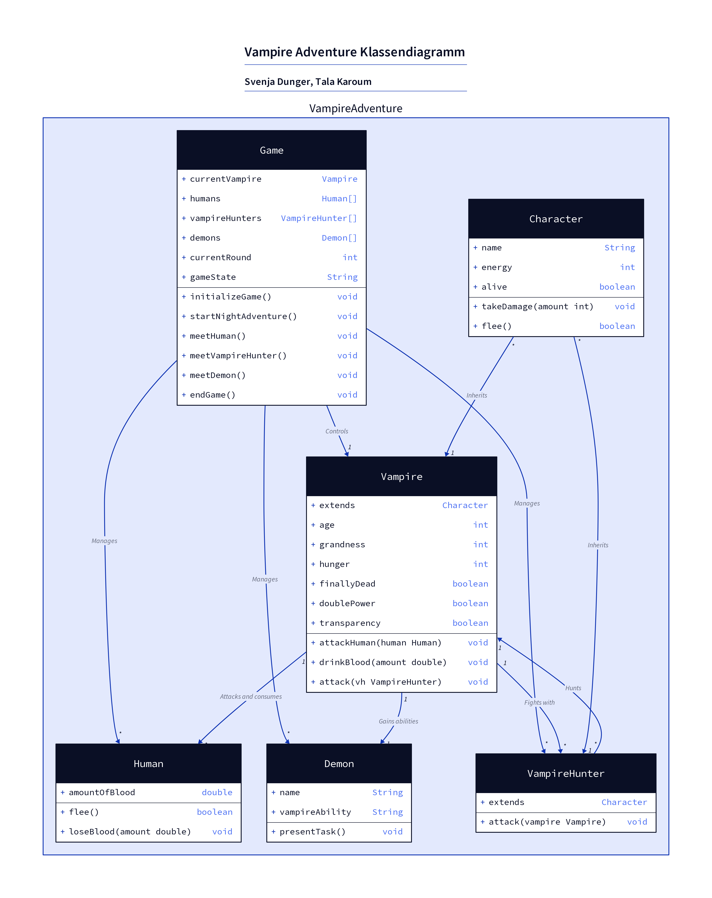

# Vampire Adventure - Textadventure-Konsolenspiel

## Beschreibung

Dieses Projekt ist ein in Java entwickeltes Textadventure-Konsolenspiel, das im Rahmen eines Programmierprojekts im Sommersemester 2024 erstellt wurde. 

In diesem Spiel schlüpfen Sie in die Rolle eines Vampirs, der tagsüber ein normales Leben führt, aber nachts auf die Jagd nach menschlichem Blut gehen muss. Das Spiel bietet folgende Hauptfunktionen:

- Erstellung und Verwaltung eines Vampir-Charakters
- Nächtliche Abenteuer mit Begegnungen mit Menschen, Dämonen und Vampirjägern
- Rätsel und Aufgaben, um besondere Fähigkeiten zu erlangen
- Kampfsystem gegen Vampirjäger
- Endgegner: Der größte Vampirjäger des Jahrhunderts

Ziel des Spiels ist es, alle drei Dämonenaufgaben zu lösen und den größten Vampirjäger des Jahrhunderts zu besiegen.

## Technical Overview (English)

This project is a text-based console game implemented in Java. Key technical aspects include:

- Object-oriented design with classes for Vampire, Human, Demon, and VampireHunter
- Console-based user interface with a main menu and various game dialogues
- Random event generation for nightly adventures
- Implementation of simple mini-games and puzzles
- Basic combat system
- Use of Java's standard libraries for input/output and random number generation

The game logic is structured around a main game loop that simulates nightly adventures, with various encounters and challenges. The project demonstrates fundamental Java programming concepts, including class design, method implementation, and basic game state management.
